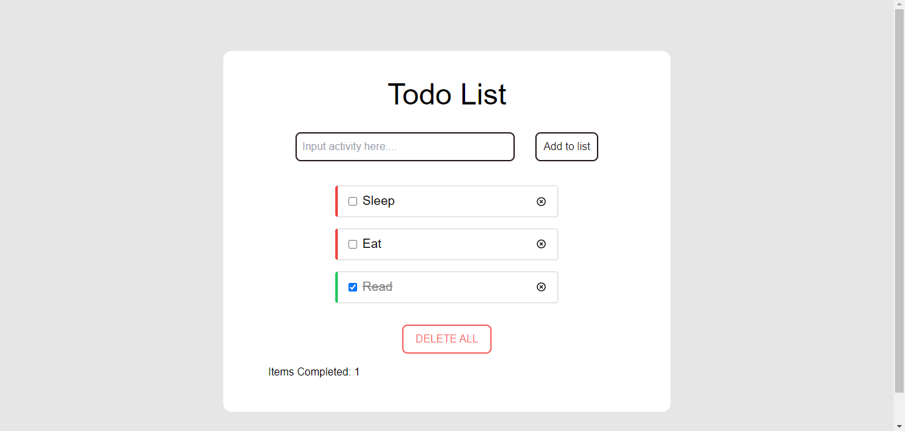
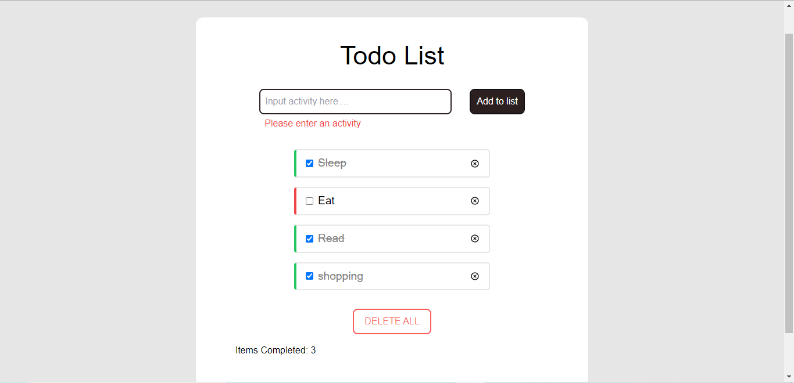
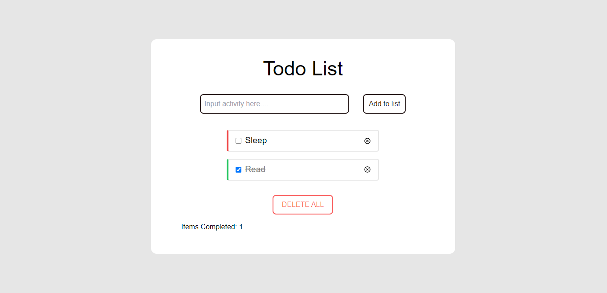
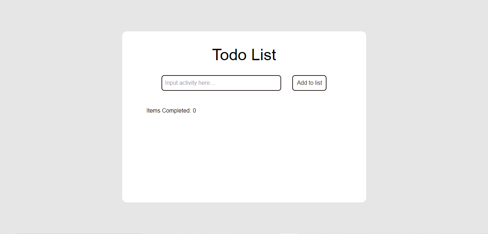

# Redux-Todo_List

Redux Todo List: This todo list project was developed using react-redux.... it possses add, toggle and remove reducer to make it effective. it comes with full mobile responsiveness.

## Getting Started

Clone or download this repository and run with a local server of open `index.html` with your favorite browser.

## Prequisite

- Your browser version must be recent for a better experience.

## Features

- Todo Page
- Add Button
- Delete All button

## Tech/framework used

- HTML
- CSS
- ReactJS
- Redux
- Vite
- Tailwind-CSS

## Preview

[Preview Here](https://redux-todo-list-amber.vercel.app/)

## Contact

If you want to contact me you can reach me at
-wolabash@gmail.com -https://github.com/PrimeFord

## Addtional Info

- This is not meant for production. It's for learning purpose only
